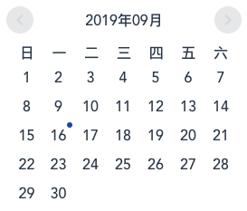
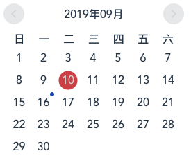
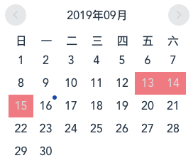
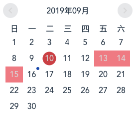

# icalender


> 一个可以标记日期范围的vue日历插件

## 预览

| 预览图 | 说明 |
|:--|:--|
|  | 没有标记 | 
|  | 标记一个日期 | 
|  | 标记一个日期范围 | 
|  | 混合标记 | 


## 使用

```bash
npm install icalender --save
```

### 全局注册组件

```js
import icalender from 'icalender';

Vue.use(icalender);
```
### 组件内使用

#### CommonJS

```javascript
var icalender = require('icalender');

new Vue({
    components: { icalender },
    data: function () {
        return {
            marks: [
                {
                    start: "2019-09-02",
                    end: "2019-09-05"
                },
                {
                    start: "2019-09-12",
                    end: "2019-09-12"
                },
                {
                    start: "2019-09-15",
                    end: "2019-09-24"
                }
            ]
        };
    },
    template: '<icalender :marks="marks" />'
});
```

#### ES6
```javascript
import icalender from 'icalender';

new Vue({
    components: { icalender },
    data: function () {
        return {
            marks: [
                {
                    start: "2019-09-02",
                    end: "2019-09-05"
                },
                {
                    start: "2019-09-12",
                    end: "2019-09-12"
                },
                {
                    start: "2019-09-15",
                    end: "2019-09-24"
                }
            ]
        };
    },
    template: '<icalender :marks="marks" />'
});
```

## API

### Props

| 属性 | 说明 | 类型 | 默认值 |
|:--|:--|:--|:--|
| marks | 可选，标记日期范围的数组,数组成员里必须包含`start`和`end`两个对象属性，例如 [{start: "2019-09-13, end: "2019-09-15"}] | Array | [] |

### Events

| 事件名 | 说明 | 返回值 |
|:--|:--|:--|
| on-click | 点击日期时触发 | 返回当前日期的属性 |
| forward | 点击向前翻动日历触发 | 返回当前年份和月份 |
| back | 点击向后翻动日历触发 | 返回当前年份和月份 |


## License

[MIT](http://opensource.org/licenses/MIT)